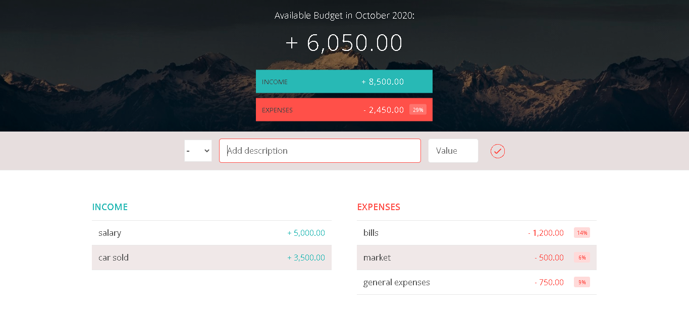

# Budget_app_controller
* Budget App controller where the user is able to add or delete expenses, the app shows the budget available and the percentage referring to the expenses.

## Deployed at:

 

## Screenshot

